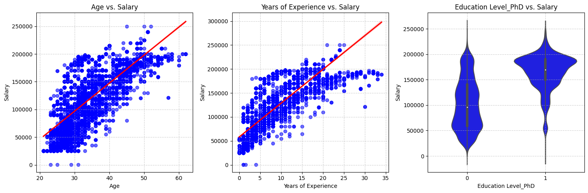
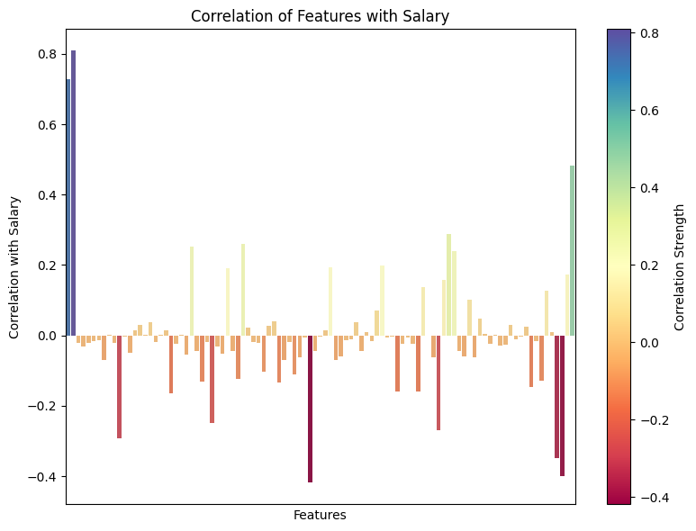
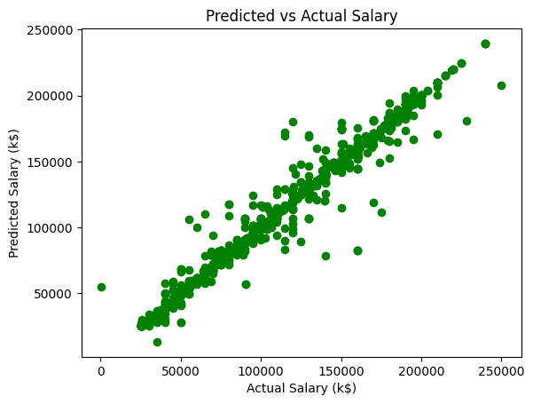
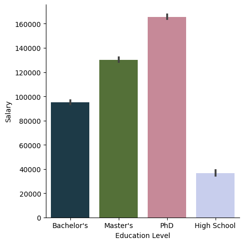
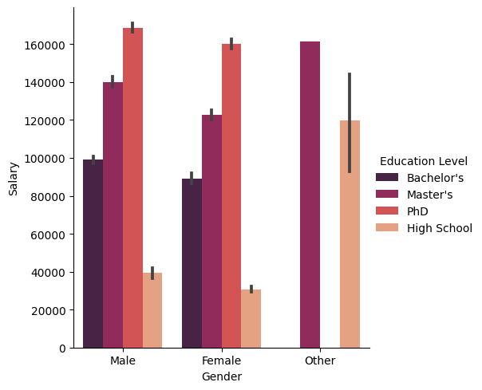
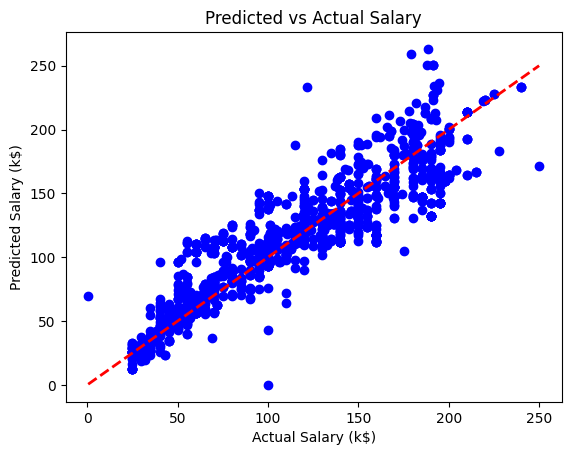
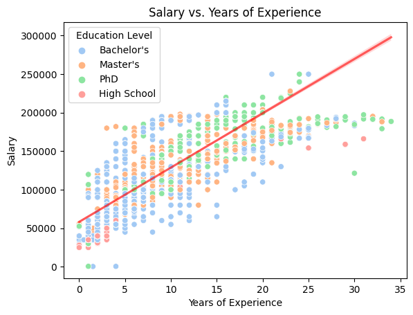

# Job Salary Prediction Using Neural Networks and Model Comparisons
 Worked with a Kaggle dataset containing demographic, experience, and job title information to predict salaries, requiring preprocessing of both structured and unstructured data.  
 Built and evaluated predictive models, including a PyTorch-based neural network, to determine factors influencing salary and assessed the most effective approach. 
# Graphs
 
 
 

# Summary
- Cleaned and standardized data, removing nulls and harmonizing inconsistent categorical entries.  
- Engineered features from job titles using TF-IDF vectorization and one-hot encoded categorical fields.  
- Conducted exploratory data analysis, revealing correlations between education, gender, experience, and salary.  
- Implemented a multi-layer neural network in PyTorch (128 → 64 → 1) with ReLU activations, trained with Adam optimizer and MSE loss.  
- Compared performance against a RandomForestRegressor baseline with 100 estimators.

Achieved a 97% $$R^2$$ score with the Random Forest model, outperforming the neural network. Demonstrated that ensemble tree methods excel on structured tabular data, while the neural network captured trends but underfit without further tuning.

Dataset: [Salary Data (Kaggle)](https://www.kaggle.com/datasets/mohithsairamreddy/salary-data)
